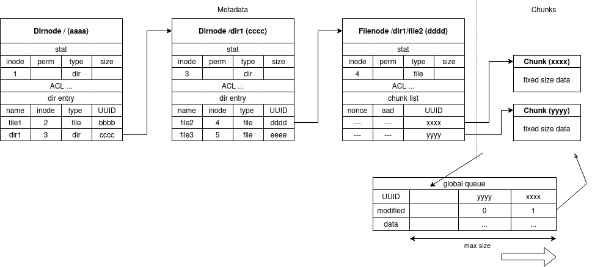

# Architecture of filesystem

## Filesystem Layers

1. fuse layer
    - operates filesystem in response to corresponding to system calls of filesystem
    - implemented by using fuse lowlevel API

1. enclave layer
    - performs main operations which is related to confidentiality and integrity of filesystem such as user authentication, access permission checks, file encryption/decryption and integrity checks
    - implemented by defining functions (ECALLs) called from fuse layer

1. storage layer
    - defines funcitons (OCALLs) called from enclave layer which operate remote or local storage
    - allows users to handle several storage APIs (local filesystem, FTP, Amazon S3, etc.) by providing abstract layer

## Filesystem Components
- each file stored in remote storage has assigned UUID as file name
- remote storage files are devided into metadata and encrypted chunks

### metadata
- metadata files are encrypted with volume key
- each of them has one of following types
    1. superinfo
        - only one metadata which stores infomation of the entire volume
        - every user knows UUID of this file
        1. UUID and hash of dirnode of root directory
        1. UUID and hash of usertable
      
    1. usertable
        - stores information of users joined in volume
        1. user name (or user ID) and their public key
        1. whether user has right to invite another user to the volume

    1. inode
        - abstract class for representing inode
        - stores common information of inode
        1. inode attributes (stat)
        1. ACL

    1. dirnode
        - derived class of inode
        - stores information of directory
        1. directory name (if needed)
        1. directory entries
            1. name
            1. inode number
            1. UUID
            1. node types
            1. hashes

    1. filenode
        - derived class of inode
        - stores information of file
        1. chunk list (direct/indirect addressing or adjacency list)
  
    1. (chunk entry)
        - this metadata is required if huge files might be stored
        - it is because without this metadata, huge file will make the number of chunk entries of filenode too large
        1. UUID of chunk
        1. chunk size
        1. chunk encryption key
        1. chunk hash

### chunks
- each chunk is encrypted with a key stored in corresponding chunk entry

